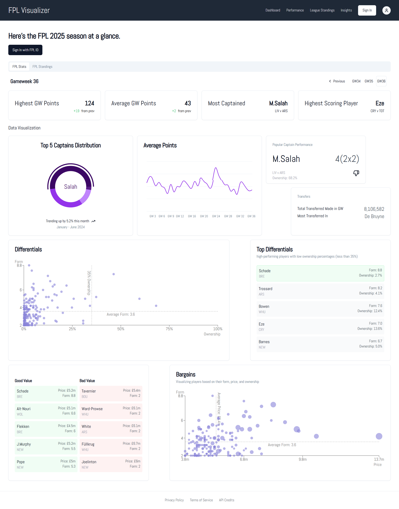

# FPL Analytics Dashboard

A comprehensive Fantasy Premier League analytics application that helps managers make data-driven decisions for their FPL teams.

## Features Overview

### Dashboard Home
The main dashboard provides a comprehensive overview of the current FPL season:

- **Live Gameweek Information**: Displays current gameweek number, deadline times, and status
- **Season Statistics**: Key metrics including highest gameweek score, average points, and most captained players
- **Interactive Gameweek Navigation**: Browse through all 38 gameweeks with pagination controls
- **Data Visualizations**: 
  - Average points trend line chart across all gameweeks
  - Captain distribution pie charts showing popular choices
  - Transfer activity and performance metrics
- **League Standings Preview**: Quick access to major FPL leagues (Overall, Second Chance, GW1 starters)

### Performance Analytics
Detailed performance tracking for signed-in managers:

#### Manager Statistics Cards
- **Gameweek Points**: Your points vs. overall average with performance indicators
- **Overall Rank**: Current rank with gameweek-specific ranking
- **Captain Performance**: Shows your captain choice, points scored, and opponent fixture
- **Transfer Activity**: Number of transfers made and their point cost
- **Team Value**: Current squad value with weekly changes
- **Bench Points**: Points left on the bench with auto-substitution info
- **Transfer Impact**: Detailed breakdown of transfers in/out with point differentials

#### Player Performance Table
- **Starting XI Overview**: Shows all 11 starting players
- **Performance Indicators**: Visual icons for exceptional (👍), average (➖), or poor (👎) performances
- **Team Information**: Player names with club abbreviations
- **Position Details**: GK, DEF, MID, FWD classifications
- **Live Points**: Real-time gameweek points for each player

#### Historical Trends
- **Season Performance Graph**: Track your points across all gameweeks
- **Rank Progression**: Visualize your overall rank changes
- **Transfer History**: Complete transfer activity with success rates
- **Captaincy Analysis**: Historical captain choices and their effectiveness

#### League Comparisons
- **Mini-League Tables**: View all your private league standings
- **Performance Comparison**: Compare against league rivals
- **Position Tracking**: Monitor your league position changes

### Insights & Strategy
Data-driven insights to improve your FPL performance:

#### Player Insights
- **Top Performers**: Highest-scoring players with ownership percentages
- **Form Analysis**: Recent performance trends and predictions
- **Value Analysis**: Price changes and value for money metrics
- **Ownership Trends**: Popular picks and differential opportunities

#### Fixture Difficulty
- **Upcoming Fixtures**: Visual difficulty ratings for all teams
- **Rotation Planning**: Plan transfers based on fixture runs
- **Home/Away Analysis**: Performance splits by venue
- **Double Gameweek Alerts**: Identify favorable fixture periods

#### Transfer Suggestions
- **Data-Driven Recommendations**: AI-powered transfer suggestions
- **Price Change Predictions**: Anticipated player price movements
- **Ownership Analysis**: Identify differentials and template players
- **ROI Calculations**: Expected points return on investment

### League Standings
Comprehensive league analysis and standings:

#### League Tables
- **Multiple League Support**: View any league you're part of
- **Detailed Rankings**: Points, gameweek performance, and trends
- **Manager Information**: Team names, total points, and recent form
- **Pagination**: Navigate through large leagues efficiently

#### League Insights
- **Statistical Breakdown**: Average scores, top performers, transfer activity
- **League Trends**: Historical performance patterns
- **Competitive Analysis**: Compare against league averages
- **Achievement Tracking**: Milestone and record tracking

## Authentication & Personalization

### FPL ID Integration
- **Secure Sign-In**: Use your official FPL ID for authentication
- **Data Privacy**: Only accesses public FPL data, never your login credentials
- **Guest Mode**: Try the app with demo data using the "Try as Guest" feature
- **Persistent Sessions**: Your FPL ID is securely stored for future visits

### Finding Your FPL ID
1. Visit the [Fantasy Premier League website](https://fantasy.premierleague.com/)
2. Log into your account
3. Navigate to the "Points" tab
4. Your FPL ID is the number in the URL after "/entry/" (e.g., 1234567)
5. Mobile users: Enable "Request Desktop Site" to see the full URL

## Responsive Design

### Desktop Experience
- **Full Dashboard Layout**: Comprehensive view with multiple data panels
- **Advanced Visualizations**: Detailed charts and interactive elements
- **Tabbed Navigation**: Easy access to all features via horizontal tabs
- **Multi-Column Layouts**: Efficient use of screen real estate

### Mobile Experience
- **Touch-Optimized Interface**: Finger-friendly navigation and controls
- **Bottom Tab Navigation**: Easy thumb access to main sections
- **Swipe Gestures**: Intuitive navigation between gameweeks
- **Responsive Charts**: Optimized visualizations for smaller screens
- **Collapsible Sections**: Expandable content to maximize screen usage

## Technical Architecture

### Frontend Technology Stack
- **React 18**: Modern React with hooks and functional components
- **TypeScript**: Full type safety throughout the application
- **Tailwind CSS**: Utility-first styling with responsive design
- **shadcn/ui**: Consistent, accessible UI components
- **Recharts**: Interactive data visualization library
- **React Query**: Efficient data fetching and caching
- **React Router**: Client-side routing and navigation

### Backend Integration
- **Supabase Platform**: Backend-as-a-Service for data and authentication
- **Edge Functions**: Serverless functions for API proxying and data processing
- **PostgreSQL Database**: Structured data storage with relationships
- **Real-time Updates**: Live data synchronization

### Database Schema
#### FPL Overall Data (`fploveralldata`)
Stores gameweek-level statistics:
- Gameweek information (id, name, deadlines)
- Scoring statistics (average points, highest score)
- Popular choices (most captained, most transferred)
- Meta information (finished status, current gameweek)

#### Player Data (`plplayerdata`)
Comprehensive player statistics:
- Basic information (name, team, position, price)
- Performance metrics (points, form, minutes played)
- Ownership data (selected by percentage, transfers)
- Advanced statistics (ICT index, expected goals, creativity)

#### Team Data (`plteams`)
Premier League team information:
- Team details (name, short name, strength ratings)
- Current season statistics (position, points, form)
- Fixture difficulty ratings (home/away strengths)

### Data Flow Architecture
1. **Data Synchronization**: Scheduled edge functions fetch data from FPL API
2. **Data Processing**: Raw API data is cleaned and structured for storage
3. **Database Storage**: Processed data stored in optimized Supabase tables
4. **API Layer**: Edge functions provide proxy access for real-time requests
5. **Client Queries**: React Query manages data fetching with caching
6. **UI Rendering**: Components render data with loading and error states

### Performance Optimizations
- **Data Caching**: Intelligent caching strategies to minimize API calls
- **Lazy Loading**: Components and data loaded on demand
- **Image Optimization**: Optimized assets for faster loading
- **Code Splitting**: Reduced initial bundle size
- **Responsive Images**: Appropriate image sizes for different devices

## Getting Started

### For Users
1. **Visit the Application**: Navigate to the deployed URL
2. **Sign In**: Click "Sign In with FPL ID" and enter your FPL ID
3. **Explore**: Use the navigation tabs to explore different features
4. **Analyze**: Review your performance and get insights
5. **Strategize**: Use the data to make informed FPL decisions

### Guest Experience
- **Try as Guest**: Use the "Try as Guest" button for a demo experience
- **Sample Data**: Explore all features with example FPL manager data
- **No Registration**: Test the application without providing your FPL ID

## Data Sources & Updates

### Official FPL API
- **Real-time Data**: Live gameweek scores and player statistics
- **Historical Data**: Complete season history and trends
- **Manager Data**: Personal team information and league standings
- **Update Frequency**: Data refreshed multiple times per gameweek

### Data Privacy & Security
- **Public Data Only**: Only accesses publicly available FPL information
- **No Credentials Stored**: Never requests or stores FPL login information
- **Secure Storage**: FPL IDs encrypted and securely stored
- **Privacy First**: No personal data beyond what's publicly available on FPL

## Design Philosophy

### User Experience
- **Data-First Design**: Information hierarchy based on relevance and importance
- **Progressive Disclosure**: Complex data revealed through user interaction
- **Consistent Patterns**: Repeatable UI patterns across all features
- **Accessibility**: Keyboard navigation and screen reader support

### Visual Design
- **Clean Interface**: Minimal clutter with focus on data clarity
- **Color Coding**: Consistent color scheme for performance indicators
- **Typography**: Clear hierarchy with readable font sizes
- **Responsive Grid**: Flexible layouts that work on all screen sizes

### Performance Indicators
- **Visual Feedback**: Icons and colors indicate performance levels
- **Contextual Information**: Relevant comparisons and benchmarks
- **Trend Indicators**: Arrows and charts show direction of change
- **Status Badges**: Clear indication of current state and changes

This FPL Analytics Dashboard transforms raw Fantasy Premier League data into actionable insights, helping managers make informed decisions and track their performance throughout the season.
